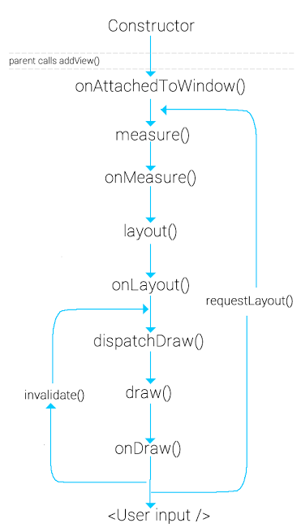

## This repository is for all test Android projects, including:

1. ActivityTest15ExplicitIntent
    * Activity.startActivityForResult() and Activity.onActivityResult()
    * Intent.hasExtra(), Intent.getExtras(), Intent.putExtra()
    * Bundle.getIntent().getExtras()
    * home icon to go back to parent activity: android.R.id.home
    * Intent.setFlags(Intent.FLAG_ACTIVITY_CLEAR_TOP)
    * ActionBar actionBar = Activity.getActionBar(), ActionBar.setHomeButtonEnabled(true)

2. ActivityTest16Browser
    * StrictMode.ThreadPolicy.Builder() and StrictMode.setThreadPolicy(policy)
    * Uri and URL
    * WebView.loadUrl()

3. ActivityTest17PickImageWithIntent
    * Intent.setType(), Intent.setAction(), Intent.addCategory(Intent.CATEGORY_OPENABLE);
    * startActivityForResult() and onActivityResult()
    * Bitmap.recycle()
    * getContentResolver().openInputStream(Intent.getData())
    * bitmap = BitmapFactory.decodeStream(stream)
    * ImageView.setImageBitmap(bitmap)

4. ActivityTest18ImplicitIntent
    * Spinner.setAdapter(adapter)
    * adapter = ArrayAdapter.createFromResource(this, R.array.intents, android.R.layout.simple_spinner_item) and Adapter.setDropDownViewResource()
    * Uri.parse(String) 
        Intent.ACTION_VIEW
        Intent.ACTION_CALL
        Intent.ACTION_DIAL
        Intent.ACTION_EDIT

5. ActivityTest19ActivityLifecycle
    * adapter = new ArrayAdapter<String>(this, android.R.layout.simple_list_item_1, values)
    spinner.setAdapter(adapter)
    * Notification notification = new Notification.Builder(this)
        .setContentTitle(title line)
        .setAutoCancel(true)
        .setSmallIcon(R.drawable.ic_launcher)
        .setContentText(further description)
        .build();
    NotificationManager notificationManager = (NotificationManager) getSystemService(NOTIFICATION_SERVICE);
    notificationManager.notify(id_of_notification, notification)

6. ActivityTest20ActionBarProg
    * ActionBar.DISPLAY_SHOW_HOME | ActionBar.DISPLAY_SHOW_TITLE | ActionBar.DISPLAY_SHOW_CUSTOM
    * MenuItem.setActionView(), expandActionView(), collapseActionView()
    * AsyncTask<String, Void, String> doInBackground() onPostExecute()

7. ActivityTest21ShareActionProvider
    * Menu.findItem().getActionProvider()
    * ShareActionProvider.setShareIntent()
    * Intent(Intent.ACTION_SEND) to Weibo or Wechat

8. ActivityTest22NavDrawer
    * 

9. ActivityTest23LogUsage
    * BuildConfig.DEBUG <=> public Boolean DEBUG = true/false(in release)
    * Log.d(Constants.LOG_TAG, “text content”); where Constants is a public interface

10. ActivityTest24SimpleDialog
    * Activity.showDialog(DIALOG_ID);
    * Builder builder = new AlertDialog.Builder(this);
        + builder.setMessage(“Dialog message shown”)
        + builder.setCancelable(true/false)
        + builder.setPositiveButton(“I agree”, new OkOnClickListener());
        + builder.setNegativeButton(“No, no”, new CancelOnClickListener());
        + AlertDialog dialog = builder.create();
        + dialog.show();
    * both OkOnClickListener and CancelOnClickListener implements DialogInterface.OnClickListener interface

11. ContentProviderTest03SQLiteBasics
    * wrapper SQLiteOpenHelper: database create() execSQL(), onCreate() and onUpgrade()
    * DAO - Data Access Object - DataSource: SQLiteDataBase, SQLiteOpenHelper
    * ContentValues
    * cursor.moveToFirst(), cursor.isAfterLast(), cursor.moveToNext(), cursor.close(), cursor.getLong(), cursor.getString()
    * database.query(), database.delete(), database.insert()
    * ArrayAdapter, ListView.setAdapter(), Adapter.add(), Adapter.notifyDataSetChanged()

12. ContentProviderTest04Contacts
    * uses-permission android:name="android.permission.READ_CONTACTS"
    * Activity.getContacts()
    * ContactsContract.Data.DISPLAY_NAME, ContactsContract.Contacts.DISPLAY_NAME, ContactsContract.Contacts.IN_VISIBLE_GROUP, ContactsContract.Contacts.CONTENT_URI
    * Activity.managedQuery() note: deprecated

13. ContentProviderTest05Todos
    * ContentResolver
    * ContentProvider.delete(), onCreate(), insert(), query(), update()
    * UriMatcher.addURI(), match()
    * throw new IllegalArgumentException() for switch(case) - default
    * AdapterView.AdapterContextMenuInfo
    * Loader, CursorLoader
    * Activity.onSaveInstanceState()

14. XmlPullParserTest01
    * factory = XmlPullParserFactory.newInstance(); factory.setNamespaceAware(true); XmlPullParser xpp = factory.newPullParser();
    * xpp.setInput(new StringReader(“some String”));
    * XmlPullParser.setInput(), .getEventType(), .next(), getName(), getText()
    * XmlPullParser.START_DOCUMENT, .END_DOCUMENT, .START_TAG, .END_TAG, TEXT

15. ActivityTest25SharedPreferences
    * res/xml/mypreferences.xml, addPreferencesFromResource(R.xml.mypreferences) in PreferenceFragment
    * getFragmentManager().beginTransaction().replace().commit();
    * SharedPreferences prefs = PreferenceManager.getDefaultSharedPreferences(this);
    * prefs.getString(<key>, <default value if failing to retrieve preferences>)
    * PreferenceCategory, Preference.setKey(), .setTitle(), .setSummary()
    * PreferenceFragment.getPreferenceScreen(), PreferenceGroup.getPreferenceCount(), Preference.getSharedPreferences()
    * SharedPreferences.registerOnSharedPreferenceChangeListener(), .unregisterOnSharedPreferenceChangeListener()
    * writeConfiguration(), readFileFromInternalStorage(), readFileFromSDCard()

16. ActivityTest26ThreadProgBar
    * ProgressBar in layout: style="?android:attr/progressBarStyleHorizontal"
    * ProgressBar.post(new Runnable), .setProgress(int), setMax in layout file
    * new Thread(runnable).start(), Thread.sleep(long inMilliSecs)

17. ActivityTest27AsyncTask
    * AsyncTask <TypeOfVarArgParams , ProgressValue , ResultValue>
    * doInBackground(TypeOfVarArgParams), onPostExecute(ProgressValue , ResultValue)
    * DefaultHttpClient client = new DefaultHttpClient();
    * HttpGet httpGet = new HttpGet(url);
    * HttpResponse execute = client.execute(httpGet);
    * InputStream content = execute.getEntity().getContent();
    * BufferedReader buffer = new BufferedReader(new InputStreamReader(content));

18. ActivityTest28Loader
    * Activity.getLoaderManager().initLoader(0, null, this);
    * Interface LoaderManager.LoaderCallbacks<SharedPreferences> onCreateLoader(), onLoadFinished(), onLoaderReset()
    * SharedPreferences.Editor .getInt(KEY, DEFAULT_VALUE), putInt(KEY, VALUE), SharedPreferencesLoader.persist(editor)
    * AsyncTaskLoader<SharedPreferences>, onContentChanged(), deliverResult(), forceLoad()
    * SharedPreferences.OnSharedPreferenceChangeListener loadInBackground(), onSharedPreferenceChanged(), onStartLoading()

19. ActivityTest29ImageLoader
    * ImageView.setImageBitmap()
    * ProgressDialog.dismiss(), show(), isShowing()
    * Thread.isAlive(), start(), sleep()
    * HttpEntity entity = response.getEntity(); byte[] bytes = EntityUtils.toByteArray(entity); 
    Bitmap bitmap = BitmapFactory.decodeByteArray(bytes, 0, bytes.length);

20. ActivityTest30JSON
    * StrictMode.ThreadPolicy.Builder().permitAll().build() = policy
    * StrictMode.setThreadPolicy(policy)
    * JSONObject.put(KEY, VALUE)
    * StringBuilder.append()
    * HttpClient = new DefaultHttpClient(), HttpGet = new HttpGet(url) -> HttpResponse -> StatusLine -> StatusCode -> 200
    * HttpResponse.getEntity() -> HttpEntity.getContent() -> InputStream => BufferedReader = new BufferedReader(new InputStreamReader(content)) -> line = reader.readLine() != null

21. GradleTest01~08 for Gradle practices

22. ActivityTest31DragDrop

23. ActivityTest09CompassOrientation - Sensor Test
    * XiaoMi Acc = 100, Mag = 50, Gyro = 100
    * T1 Acc = 120, Mag = 60, Gyro = 200

24. ActivityTest32Drawable
    * AssetManager, Activity.getAssets() from assets folder
    * InputStream open = AssetManager#open("apple.png");
    * Bitmap bitmap = BitmapFactory.decodeStream(open);
    * ImageView#setImageBitmap(bitmap)
    * InputStream#close()
    * Bitmap bitmap = BitmapFactory.decodeResource(getResources(), R.drawable.apple) from drawable folder

25. ActivityTest33CumtomDrawable

26. WidgetTest01RandomNumber

27. WidgetTest02UpdateWithService

28. ServiceTest02DownloadFile
    * IntentService, #onHandleIntent()
    * Environment.getExternalStorageDirectory()
    * URL#openConnection().getInputStream()
    * sendBroadcast(intent)
    * BroadcastReceiver @Override onReceive(), registerReceiver(BroadcastReceiver, IntentFilter) in onResume(), and unregisterReceiver(BroadcastReceiver) in onPause()

29. ServiceTest03BindLocalService
    * bindService(Intent, ServiceConnection, flags), unbindService(ServiceConnection)
    * access service by Service's public methods after defined in ServiceConnection'

30. ServiceTest04JobScheduler

31. BroadcastReceiverTest01DisplayCallNum
    * extends BroadcastReceiver, onReceive()
    * intent.getExtras().getString(TelephonyManager.EXTRA_STATE)
    * if (state.equals(TelephonyManager.EXTRA_STATE_RINGING)), then String phoneNumber = extras.getString(TelephonyManager.EXTRA_INCOMING_NUMBER);

32. BroadcastReceiverTest02AlarmManager
    * with issue on vibrating for multiple times

33. NotificationTest01Builder
    * Notification n  = new Notification.Builder(this)
        .setContentTitle("New mail from " + "test@gmail.com")
        .setContentText("Subject")
        .setSmallIcon(R.drawable.ic_launcher)
        .setContentIntent(pIntent)
        .setAutoCancel(true)
        .addAction(R.drawable.ic_launcher, "Call", pIntent)
        .addAction(R.drawable.ic_launcher, "More", pIntent)
        .addAction(R.drawable.ic_launcher, "And more", pIntent).build();
    * NotificationManager notificationManager = (NotificationManager) getSystemService(NOTIFICATION_SERVICE);
    * notificationManager.notify(0, n);

34. TestProject02Activity, TestProject02LayoutTest and TestProject02FunctionTest
    * JUnit example, test layout

35. TestProject03Async, TestProject03AsyncTest
    * JUnit, test AsyncTask

36. ActivityTest34SensSampleRate
    * Monitor sensors (accelerometer, gyroscope and magnetic field) sampling rate on the mobile

37. ActivityTest36SimplePedometer

38. ActivityTest35ActTransAnimation

39. ActivityTest37ViewAnimation

40. ActivityTest38Network

41. ActivityTest39Storage

42. ActivityTest40Soundpool

43. ActivityTest41SoundRecording
<table sytle="border: 0px;">
<tr>
<td></td>
</tr>
</table>

44. ActivityTest42Storage
    * test SharedPreferences, get, edit and commit
    * example is from [Android Official Site - Storage](https://developer.android.com/guide/topics/providers/document-provider.html)
    * storage directory:
        + getFilesDir(): /data/data/cn.nec.nlc.example.jamesli.activitytest42storage/files
        + getExternalFilesDir():
            - Docs: /storage/sdcard/Android/data/cn.nec.nlc.example.jamesli.activitytest42storage/files/Documents
            - Movies: /storage/sdcard/Android/data/cn.nec.nlc.example.jamesli.activitytest42storage/files/Movies
            - Music: /storage/sdcard/Android/data/cn.nec.nlc.example.jamesli.activitytest42storage/files/Music
            - Pictures: /storage/sdcard/Android/data/cn.nec.nlc.example.jamesli.activitytest42storage/files/Pictures
            - DCIM: /storage/sdcard/Android/data/cn.nec.nlc.example.jamesli.activitytest42storage/files/DCIM

45. ActivityTest43Gyroscope
    * Note: the app does not work with Smartisan T1 in Android 4.4, the reason is defing timestamp as float will lead a round-up problem in "dT = (sensorEvent.timestamp - timestamp) * NS2S" i.e. dT = 0.0, the solution is to define private *long* timestamp
    * The same issue applies to ActivityTest47CanvasView

46. ActivityTest44RequestFile
    * basesd on ActivityTest17PickImageWithIntent
    * [Loading Large Bitmaps Efficiently](http://developer.android.com/training/displaying-bitmaps/load-bitmap.html)
    * handle OOM (OutOfMemoryError Exception) from getContentResolver().openInputStream(returnUri) by setting options.inJustDecodeBounds = true;

47. ActivityTest45ImageZoom

48. ActivityTest46Resource
    * see examples from Erik Hellman's book - [Android Programming - Pushing the limits](http://atibook.ir/dl/en/Engineering/Computer%20Science/9781118717370_android_programming.pdf)
    * note commen error [Resources$NotFoundException](http://blog.csdn.net/zhouyingge1104/article/details/39338271)

49. ActivityTest47CanvasView
    * lifecycle of android.view.View
<table sytle="border: 0px;">
<tr>
<td></td>
</tr>
</table>
    * usage of invalidate()

50. BroadcastReceivertest03NetMonitor
    * monitor Wifi and Mobile network connectivity through BroadcastReceiver
    * more specifically, WifiManager and ConnectivityManager
    * remember to get use permission in manifest.xml
<table sytle="border: 0px;">
<tr>
    <td>uses-permission android:name="android.permission.ACCESS_NETWORK_STATE"</td>
</tr>
<tr>
    <td>uses-permission android:name="android.permission.CHANGE_NETWORK_STATE"</td>
</tr>
<tr>
    <td>uses-permission android:name="android.permission.ACCESS_WIFI_STATE"</td>
</tr>
<tr>
    <td>uses-permission android:name="android.permission.CHANGE_WIFI_STATE"</td>
</tr>
</table>
    * [How to disable/enable Mobile Data on Android?](http://stackoverflow.com/questions/13171623/how-to-turn-on-3g-mobile-data-programmatically-in-android)

51. ActivityTest48SendToOtherActivity
    * sendIntent.setAction(Intent.ACTION_SEND);
    * sendIntent.putExtra(Intent.EXTRA_TEXT, messageSent);
    * sendIntent.setType("text/plain");
    * startActivity(Intent.createChooser(sendIntent, getResources().getText(R.string.send_text_to)));
    * share action in your ActionBar is made even easier with the introduction of **ActionProvider** in Android 4.0 (API Level 14)

52. ActivityTest49ReceiveFromOtherActivity
    * receive Intent.ACTION_SEND with text/plain and image/jpeg, or Intent.ACTION_SEND_MULTIPLE with multiple images image/*

53. ServiceTest05IntentService
    * IntentService class provides a straightforward structure for running an operation on a single background thread, i.e. handling long-running operations without affecting your UI's responsiveness.
    * Activity that sends work requests to the service uses an explicit Intent, so no intent-filter is needed in manifest.xml.
    * unfinished!!
